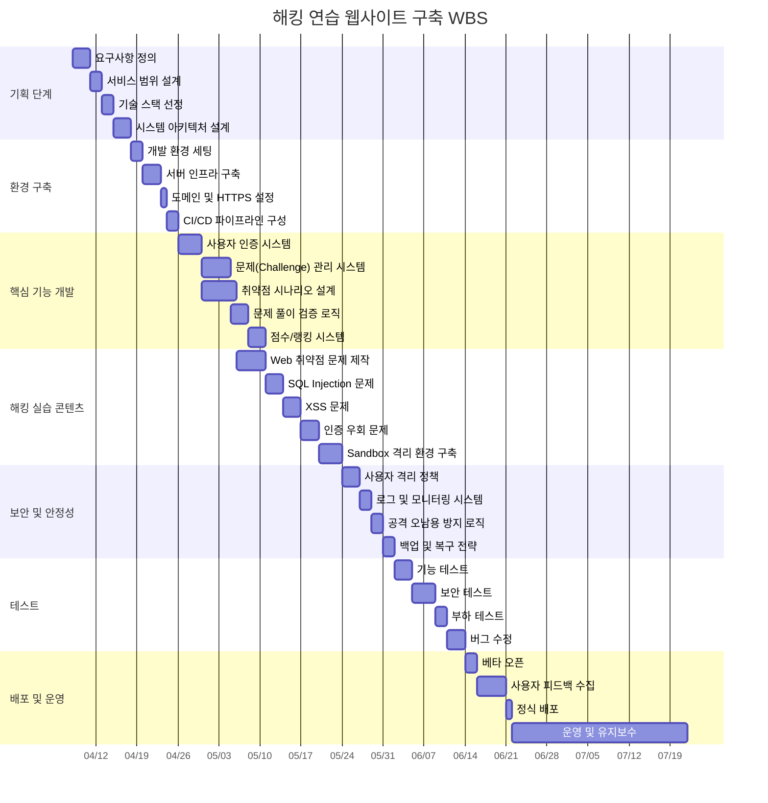

# vibe
바이브코딩 수업용 테스트

```
안녕하세요
```
```python
print('hello')
```

```mermaid
gantt
    title 해킹 연습 웹사이트 구축 WBS
    dateFormat  YYYY-MM-DD
    axisFormat  %m/%d

    section 기획 단계
    요구사항 정의               :a1, 2026-04-08, 3d
    서비스 범위 설계            :a2, after a1, 2d
    기술 스택 선정              :a3, after a2, 2d
    시스템 아키텍처 설계        :a4, after a3, 3d

    section 환경 구축
    개발 환경 세팅              :b1, after a4, 2d
    서버 인프라 구축            :b2, after b1, 3d
    도메인 및 HTTPS 설정        :b3, after b2, 1d
    CI/CD 파이프라인 구성       :b4, after b3, 2d

    section 핵심 기능 개발
    사용자 인증 시스템          :c1, after b4, 4d
    문제(Challenge) 관리 시스템 :c2, after c1, 5d
    취약점 시나리오 설계        :c3, after c1, 6d
    문제 풀이 검증 로직          :c4, after c2, 3d
    점수/랭킹 시스템             :c5, after c4, 3d

    section 해킹 실습 콘텐츠
    Web 취약점 문제 제작        :d1, after c3, 5d
    SQL Injection 문제          :d2, after d1, 3d
    XSS 문제                    :d3, after d2, 3d
    인증 우회 문제              :d4, after d3, 3d
    Sandbox 격리 환경 구축      :d5, after d4, 4d

    section 보안 및 안정성
    사용자 격리 정책            :e1, after d5, 3d
    로그 및 모니터링 시스템     :e2, after e1, 2d
    공격 오남용 방지 로직       :e3, after e2, 2d
    백업 및 복구 전략           :e4, after e3, 2d

    section 테스트
    기능 테스트                 :f1, after e4, 3d
    보안 테스트                 :f2, after f1, 4d
    부하 테스트                 :f3, after f2, 2d
    버그 수정                   :f4, after f3, 3d

    section 배포 및 운영
    베타 오픈                   :g1, after f4, 2d
    사용자 피드백 수집          :g2, after g1, 5d
    정식 배포                   :g3, after g2, 1d
    운영 및 유지보수            :g4, after g3, 30d
```
